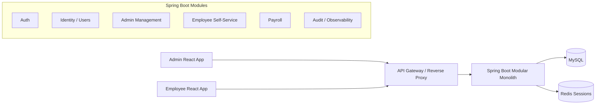

# Payroll System V2 Architecture

> Status: Draft
> Author: OpenAI Systems Architect
> Date: 2026-04-16
> Reviewers: Project owner

## Table of Contents

1. [Overview](#overview)
2. [Architecture](#architecture)
3. [Data Model](#data-model)
4. [API Contracts](#api-contracts)
5. [User Experience](#user-experience)
6. [User Interface](#user-interface)
7. [Infrastructure](#infrastructure)
8. [Implementation Plan](#implementation-plan)
9. [Risks \/ Mitigations](#risks--mitigations)
10. [Alternatives Considered](#alternatives-considered)
11. [Open Questions](#open-questions)

---

## Overview

### Problem Statement

The current system is a single Spring Boot backend plus static HTML\/CSS\/JavaScript pages. Role selection is enforced only in the browser through `sessionStorage`, while backend APIs are open. This creates four major problems:

1. Manager and employee experiences are mixed into one frontend.
2. There is no real authentication or authorization boundary.
3. Employees can potentially access manager-only backend actions if they call the API directly.
4. The current structure will become harder to maintain as payroll features, users, and audit needs grow.

### Goals

- Separate the product into a dedicated **Admin site** and **Employee site**.
- Introduce real backend authentication and authorization.
- Ensure **employees cannot log into the manager portal** and cannot access manager-only APIs.
- Move to a **React + Spring Boot** architecture that is easier to scale and maintain.
- Keep the backend as a **modular monolith** so it stays simple today but can evolve later.
- Standardize API contracts, security, and frontend app structure.

### Non-Goals (Out of Scope)

- Full microservices migration on day 1.
- Multi-tenant payroll for multiple companies.
- SSO\/OAuth with third-party identity providers in the first iteration.
- Native mobile apps.

### Success Metrics

- 100% of non-public API endpoints require backend authentication.
- 100% of manager-only endpoints reject employee accounts with `403`.
- Admin and employee users access different frontends and different route spaces.
- Session state is server-trusted; the frontend never becomes the source of truth for role decisions.
- New features can be added inside a bounded module without editing unrelated modules.

### Current-State Summary

- Backend: Spring Boot 3.3.4, Spring Web, Spring Data JPA, MySQL.
- Frontend: static HTML pages with page-specific vanilla JS.
- Current role gating: `sessionStorage` only, see `frontend/js/common.js`.
- Current API surface: open endpoints under `/api`, including employee CRUD and payroll actions.
- Current schema: `employees` and `payroll_records` only.

---

## Architecture

### Recommended Target Shape

- **Two React apps in one frontend monorepo**
  - `apps/admin-web`
  - `apps/employee-web`
- **One Spring Boot backend** as a **modular monolith**
- **MySQL** for system of record
- **Redis** for session storage and horizontal scaling
- Shared API contract under `/api/v1`

### Why this is the recommended architecture

- Two frontends create a clean UX and security boundary between admin and employee experiences.
- A modular monolith is the best tradeoff here: much safer and cheaper than microservices, but still highly maintainable.
- Server-side sessions are the better default for browser-based React apps because they reduce token leakage risk and centralize revocation.
- Redis-backed sessions let the backend scale horizontally without making auth state node-local.

### High-Level Architecture Diagram



### Frontend Architecture

#### App split

- **Admin site**
  - audience: managers
  - purpose: employee management, payroll processing, payroll reporting, administrative actions
  - domain example: `admin.payroll.example.com`

- **Employee site**
  - audience: employees
  - purpose: view own profile, own payroll history, own payslips\/summaries
  - domain example: `employee.payroll.example.com`

#### Shared frontend packages

- `packages/ui`: shared design system components
- `packages/api-client`: typed API client and request helpers
- `packages/auth`: auth state helpers, session bootstrapping, CSRF helpers
- `packages/types`: shared API and domain DTO types

#### Frontend rules

- Frontend route guards improve UX, but **backend authorization remains authoritative**.
- Admin and employee apps must not share route trees.
- Shared code is allowed only for low-level UI and API utilities, not for cross-role page logic.

### Backend Architecture

#### Recommended module boundaries

1. **Auth module**
   - login
   - logout
   - session lifecycle
   - password hashing
   - CSRF integration
   - account lockout\/rate limiting hooks

2. **Identity module**
   - user accounts
   - role assignment
   - employee-to-user linkage
   - account status

3. **Admin Management module**
   - manager-only employee CRUD
   - manager-only payroll administration
   - manager-only dashboard

4. **Employee Self-Service module**
   - authenticated employee profile view
   - authenticated employee payroll history
   - employee dashboard

5. **Payroll module**
   - pay period logic
   - gross pay calculations
   - deductions, bonus, net pay
   - payroll run generation
   - payroll record persistence

6. **Audit\/Observability module**
   - audit events for login, logout, payroll run creation, employee updates
   - security-relevant logging

#### Backend layering

```text
Presentation: controllers / request DTOs / response DTOs
Application: use cases / orchestration / transactions
Domain: business rules / policies / aggregates
Infrastructure: JPA / Redis / hashing / email / logging
```

### Authentication Strategy

#### Recommendation

Use **cookie-based session authentication** with Spring Security.

- session cookie: `HttpOnly`, `Secure` in production, `SameSite=Lax`
- CSRF token required for `POST`, `PUT`, `PATCH`, `DELETE`
- sessions stored in **Redis**
- session ID rotated on login

#### Why not localStorage JWT

- Browser apps are more exposed to token theft when tokens are readable by JavaScript.
- Revocation and logout are more complex.
- Cookie sessions fit the requested website architecture better.

### Authorization Strategy

#### Recommendation

Use **RBAC + ownership checks**.

- Roles:
  - `MANAGER`
  - `EMPLOYEE`
- Deny by default.
- Route namespace and policy checks both apply.
- Employee access must be restricted to their own resources.

#### Core rules

- `/api/v1/admin/**` requires `MANAGER`
- `/api/v1/employee/**` requires `EMPLOYEE`
- `POST /api/v1/admin/auth/login` accepts only `MANAGER`
- `POST /api/v1/employee/auth/login` accepts only `EMPLOYEE`
- Cross-portal login attempt returns `403 role_mismatch`

### Security Boundaries

- Never trust client-stored role state.
- All state-changing endpoints require auth + CSRF.
- Passwords stored only as strong hashes.
- No credential values in frontend code.
- Rate limit login endpoints.
- Audit successful and failed logins.
- CORS must be narrowed to known frontend origins; remove `*` in production.

### Deployment Topology

#### Production

- `admin.<domain>` → static React app
- `employee.<domain>` → static React app
- `api.<domain>` → Spring Boot backend
- Redis and MySQL on private network

#### Local development

- `http://localhost:5173` → admin web
- `http://localhost:5174` → employee web
- `http://localhost:8080` → backend API

---

## Data Model

### Design Notes

The current schema only models `employees` and `payroll_records`. V2 needs explicit identity and auth entities. See [Architecture > Authentication Strategy](#authentication-strategy).

### Entity: UserAccount

- `id`: UUID (PK)
- `email`: string (unique, indexed, normalized lowercase)
- `role`: enum (`MANAGER`, `EMPLOYEE`) (indexed)
- `status`: enum (`ACTIVE`, `LOCKED`, `DISABLED`)
- `employee_profile_id`: UUID (nullable, unique FK)
- `last_login_at`: timestamp (nullable)
- `created_at`: timestamp
- `updated_at`: timestamp

Relationships:

- belongs_to optional `EmployeeProfile`
- has_one `PasswordCredential`
- has_many `AuthSession`

Indexes:

- unique(`email`)
- index(`role`, `status`)

### Entity: PasswordCredential

- `user_account_id`: UUID (PK, FK)
- `password_hash`: string
- `password_algorithm`: string
- `password_updated_at`: timestamp

Relationships:

- belongs_to `UserAccount`

### Entity: AuthSession

- `id`: UUID (PK)
- `user_account_id`: UUID (FK, indexed)
- `csrf_token_hash`: string
- `ip_address`: string
- `user_agent`: string
- `created_at`: timestamp
- `last_seen_at`: timestamp
- `expires_at`: timestamp (indexed)
- `revoked_at`: timestamp (nullable)

Relationships:

- belongs_to `UserAccount`

### Entity: EmployeeProfile

- `id`: UUID (PK)
- `employee_number`: string (unique, indexed)
- `first_name`: string
- `last_name`: string
- `full_name`: derived or materialized for search
- `campus`: enum or reference
- `position`: string
- `work_area`: string
- `hourly_rate`: decimal(10,2)
- `employment_status`: enum (`ACTIVE`, `INACTIVE`)
- `created_at`: timestamp
- `updated_at`: timestamp

Relationships:

- has_one optional `UserAccount`
- has_many `PayrollRecord`

Indexes:

- unique(`employee_number`)
- index(`campus`, `employment_status`)
- index(`last_name`, `first_name`)

### Entity: PayrollRun

- `id`: UUID (PK)
- `pay_period_start`: date
- `pay_period_end`: date
- `campus_scope`: string or nullable for all campuses
- `status`: enum (`DRAFT`, `FINALIZED`, `CANCELLED`)
- `created_by_user_id`: UUID (FK)
- `created_at`: timestamp
- `finalized_at`: timestamp (nullable)

Relationships:

- belongs_to `UserAccount` as creator
- has_many `PayrollRecord`

Indexes:

- index(`pay_period_end`, `status`)
- index(`created_by_user_id`, `created_at`)

### Entity: PayrollRecord

- `id`: UUID (PK)
- `employee_profile_id`: UUID (FK, indexed)
- `payroll_run_id`: UUID (FK, indexed)
- `hours_worked`: decimal(10,2)
- `hourly_rate`: decimal(10,2)
- `gross_pay`: decimal(10,2)
- `bonus`: decimal(10,2)
- `deductions`: decimal(10,2)
- `net_pay`: decimal(10,2)
- `pay_period_start`: date
- `pay_period_end`: date
- `generated_at`: timestamp

Relationships:

- belongs_to `EmployeeProfile`
- belongs_to `PayrollRun`

Indexes:

- index(`employee_profile_id`, `pay_period_end`)
- unique(`payroll_run_id`, `employee_profile_id`)

### Entity: AuditEvent

- `id`: UUID (PK)
- `actor_user_id`: UUID (nullable FK)
- `event_type`: string (indexed)
- `resource_type`: string
- `resource_id`: string
- `result`: enum (`SUCCESS`, `FAILURE`)
- `metadata_json`: JSON
- `created_at`: timestamp

Indexes:

- index(`event_type`, `created_at`)
- index(`actor_user_id`, `created_at`)

### Migration Strategy

1. Add auth and identity tables without breaking current payroll tables.
2. Introduce `employee_profiles` and map current `employees` rows into them.
3. Create `user_accounts` only for people who need login access.
4. Introduce `payroll_runs` and migrate old `payroll_records` shape if needed.
5. Deprecate direct use of the legacy `employees` table after cutover.

---

## API Contracts

### API conventions

- Versioned base path: `/api/v1`
- Success envelope:

```json
{ "ok": true, "data": {} }
```

- Error envelope:

```json
{
  "ok": false,
  "error": {
    "code": "validation_failed",
    "message": "invalid input",
    "fields": { "email": "required" }
  }
}
```

### Auth endpoints

#### POST /api/v1/admin/auth/login

- Purpose: authenticate a manager into the admin site.
- Request:
  - `email: string`
  - `password: string`
- Response:
  - session cookie set
  - CSRF token cookie\/header initialized
  - body: `{ ok: true, data: { user: { id, email, role } } }`
- Errors:
  - `401 invalid_credentials`
  - `403 role_mismatch`
  - `423 account_locked`
- Auth: none

#### POST /api/v1/employee/auth/login

- Purpose: authenticate an employee into the employee site.
- Request:
  - `email: string`
  - `password: string`
- Response:
  - session cookie set
  - CSRF token cookie\/header initialized
  - body: `{ ok: true, data: { user: { id, email, role, employeeProfileId } } }`
- Errors:
  - `401 invalid_credentials`
  - `403 role_mismatch`
  - `423 account_locked`
- Auth: none

#### GET /api/v1/auth/me

- Purpose: return the currently authenticated user context.
- Response:
  - `{ ok: true, data: { user: { id, email, role }, portalAccess: [...] } }`
- Errors:
  - `401 unauthenticated`
- Auth: required

#### POST /api/v1/auth/logout

- Purpose: revoke current session.
- Response:
  - `{ ok: true, data: { loggedOut: true } }`
- Errors:
  - `401 unauthenticated`
- Auth: required
- CSRF: required

### Admin endpoints

#### GET /api/v1/admin/dashboard/summary

- Purpose: admin overview metrics.
- Response:
  - employee count
  - payroll totals
  - recent payroll run summary
- Errors:
  - `401 unauthenticated`
  - `403 forbidden`
- Auth: `MANAGER`

#### GET /api/v1/admin/employees

- Purpose: list employees with pagination and filtering.
- Query:
  - `page`
  - `perPage`
  - `campus`
  - `search`
  - `employmentStatus`
- Response:
  - paginated employee summaries
- Auth: `MANAGER`

#### POST /api/v1/admin/employees

- Purpose: create employee profile and optional employee login account.
- Request:
  - employee profile fields
  - optional login provisioning flags
- Errors:
  - `422 validation_failed`
  - `409 conflict`
- Auth: `MANAGER`
- CSRF: required

#### PATCH /api/v1/admin/employees/{employeeId}

- Purpose: update employee profile and compensation settings.
- Auth: `MANAGER`
- CSRF: required

#### POST /api/v1/admin/payroll-runs

- Purpose: create a payroll run for a pay period.
- Request:
  - `payPeriodStart`
  - `payPeriodEnd`
  - `campusScope`
- Response:
  - payroll run id and record count
- Errors:
  - `422 validation_failed`
  - `409 payroll_run_exists`
- Auth: `MANAGER`
- CSRF: required

#### GET /api/v1/admin/payroll-runs/{payrollRunId}

- Purpose: retrieve payroll run detail with records.
- Auth: `MANAGER`

### Employee endpoints

#### GET /api/v1/employee/dashboard/summary

- Purpose: employee dashboard summary for the authenticated employee only.
- Response:
  - latest pay period
  - latest net pay
  - record count
- Auth: `EMPLOYEE`

#### GET /api/v1/employee/profile

- Purpose: fetch the authenticated employee's own profile.
- Auth: `EMPLOYEE`

#### GET /api/v1/employee/payroll-records

- Purpose: list the authenticated employee's own payroll records.
- Query:
  - `page`
  - `perPage`
  - `payPeriodStart`
  - `payPeriodEnd`
- Auth: `EMPLOYEE`

#### GET /api/v1/employee/payroll-records/{recordId}

- Purpose: fetch one payroll record if it belongs to the current employee.
- Errors:
  - `404 not_found`
  - `403 forbidden` if ownership rules reject access before concealment policy
- Auth: `EMPLOYEE`

### Status code semantics

- `401`: no valid session
- `403`: valid session, wrong role or denied by policy
- `404`: resource missing or hidden by ownership policy
- `409`: state conflict
- `422`: validation error

---

## User Experience

### Flow: Admin Login

1. Manager lands on admin login page.
2. Manager enters email and password.
3. System validates input inline.
4. On submit, frontend calls `POST /api/v1/admin/auth/login`.
5. Success:
   - session cookie is set
   - app loads `/api/v1/auth/me`
   - user is redirected to admin dashboard
6. Invalid credentials:
   - show inline form error
7. Role mismatch:
   - show explicit message: "This account does not have manager access."

### Flow: Employee Login

1. Employee lands on employee login page.
2. Employee enters email and password.
3. Frontend calls `POST /api/v1/employee/auth/login`.
4. Success:
   - session cookie is set
   - redirect to employee dashboard
5. Role mismatch:
   - show explicit message: "This account does not have employee portal access."

### Flow: Unauthorized API Access

1. User calls protected endpoint without session.
2. Backend returns `401 unauthenticated`.
3. Frontend clears local auth state and redirects to the correct login page.

### Flow: Employee Tries to Access Manager Resource

1. Employee manually enters admin URL or calls admin API.
2. Frontend route guard blocks UX path when possible.
3. Backend still evaluates role.
4. Backend returns `403 forbidden`.
5. Frontend shows access denied screen or redirects to employee dashboard.

### Flow: Manager Creates Payroll Run

1. Manager opens payroll run creation page.
2. Manager selects pay period and optional campus scope.
3. Frontend validates required fields.
4. On submit, app sends CSRF-protected request.
5. Backend creates payroll run and records transactionally.
6. Success state shows record count and next actions.

### UX states

#### Common states

- Loading: skeletons, not empty white screens
- Empty: explicit no-data state with next step CTA
- Error: consistent API error surface
- Session expired: clear re-auth prompt
- Forbidden: role-aware message, not generic failure

### Accessibility requirements

- Fully keyboard navigable login, table, and form workflows
- Semantic form labels and error announcements
- Color is never the only indicator for access or error states
- Minimum AA contrast for both portals

---

## User Interface

### UI direction

- Admin and employee portals should feel related but not identical.
- Shared design system is allowed for typography, forms, buttons, tables, alerts, and layout primitives.
- Portal-specific branding and navigation should differ clearly.

### Component: AdminLoginPage

Layout:

- Centered login card
- Product title, manager-specific subtitle
- Email and password fields
- Primary submit button
- Error banner region

States:

- Default
- Field validation error
- Invalid credentials
- Role mismatch
- Loading

### Component: EmployeeLoginPage

Layout:

- Similar login structure but employee-specific title and tone
- Simpler supporting copy than admin portal

States:

- Default
- Validation error
- Invalid credentials
- Role mismatch
- Loading

### Component: AdminAppShell

Layout:

- Left sidebar or top nav with manager-only routes
- Header with current user and logout
- Content container for tables, forms, and reports

Navigation:

- Dashboard
- Employees
- Payroll Runs
- Reports

### Component: EmployeeAppShell

Layout:

- Simpler top navigation
- Dashboard
- Profile
- Payroll History
- Logout

### Component: EmployeeTable (Admin only)

Layout:

- Search and filters above table
- Paginated results
- Action menu per row

States:

- Empty
- Loading
- Error
- Populated

### Component: PayrollHistoryList (Employee only)

Layout:

- Period filter
- Record list\/table
- Detail panel or detail page

States:

- No payroll records yet
- Loading
- Error
- Populated

### Responsive behavior

- Mobile employee portal should remain first-class.
- Admin portal can optimize for tablet\/desktop, but must still be usable on smaller screens.
- Wide tables should support horizontal scroll and preserved column headers.

---

## Infrastructure

### Hosting

- React apps: static hosting via CDN, object storage, or Nginx
- Spring Boot API: containerized deployment behind reverse proxy\/load balancer
- MySQL: managed service or hardened VM
- Redis: managed service or internal cache node

### Scaling

- Scale React apps horizontally as static assets
- Scale Spring Boot instances horizontally behind a load balancer
- Keep session state externalized in Redis
- Use MySQL read optimization and indexes before introducing service splits

### Monitoring

Track at minimum:

- login success\/failure counts
- `401` and `403` rates
- payroll run creation count and latency
- API p95 latency by endpoint
- DB connection pool health
- Redis session availability

### Logging

- Structured JSON logs in backend
- Request ID per request
- Security audit events for auth and payroll administration
- Never log passwords, raw session IDs, or CSRF tokens

### Backup and Recovery

- Daily MySQL backups
- Point-in-time recovery if available
- Redis treated as disposable for sessions, not primary system of record

### CI\/CD

- Separate build jobs for backend, admin app, and employee app
- Required checks:
  - backend tests
  - frontend lint\/test
  - build artifacts
  - security dependency scan

---

## Implementation Plan

### Phase 1: Foundation and Security (estimated: 3-5 days)

- [ ] Introduce modular backend package boundaries
  - Directories: backend auth, identity, admin, employee, payroll, common
  - Verify: modules compile cleanly with explicit ownership
- [ ] Add Spring Security foundation with session auth and CSRF
  - Verify: protected routes return `401` when unauthenticated
- [ ] Add user, credential, and session schema
  - Verify: migration applies and login data can be stored
- [ ] Introduce centralized error envelope
  - Verify: auth and validation errors share one response shape

### Phase 2: Auth and Identity MVP (estimated: 3-4 days)

- [ ] Build role-scoped login endpoints
  - Verify: employee account rejected by admin login
- [ ] Add logout and `auth/me`
  - Verify: session lifecycle works end to end
- [ ] Add account provisioning path for managers to create employee logins
  - Verify: new employee can authenticate only in employee portal

### Phase 3: Frontend Platform Migration to React (estimated: 4-6 days)

- [ ] Create frontend monorepo structure
  - Files: `apps/admin-web`, `apps/employee-web`, shared packages
  - Verify: both apps build independently
- [ ] Create shared design system and API client packages
  - Verify: both apps consume shared primitives
- [ ] Build separate login pages and auth bootstrapping
  - Verify: portal-specific login and logout work

### Phase 4: Admin Portal MVP (estimated: 4-6 days)

- [ ] Build admin shell and dashboard
- [ ] Migrate employee management CRUD to admin-only endpoints and UI
- [ ] Build payroll run management UI
- [ ] Add admin authorization tests
  - Verify: employee session cannot access any admin function

### Phase 5: Employee Portal MVP (estimated: 3-5 days)

- [ ] Build employee shell and dashboard
- [ ] Add employee profile endpoint and page
- [ ] Add employee payroll history endpoint and page
- [ ] Add ownership enforcement tests
  - Verify: employee sees only own payroll records

### Phase 6: Hardening and Cutover (estimated: 3-4 days)

- [ ] Replace permissive CORS with known origins
- [ ] Add rate limiting and audit logging around auth
- [ ] Finalize migration from legacy static pages
- [ ] Update docs and operational runbooks
  - Verify: legacy role-only frontend paths are no longer authoritative

---

## Risks & Mitigations

| Risk                                                            | Impact | Likelihood | Mitigation                                                                                                        |
| --------------------------------------------------------------- | ------ | ---------- | ----------------------------------------------------------------------------------------------------------------- |
| Auth added incorrectly and blocks valid users                   | High   | Medium     | Build auth in isolated phase, add integration tests for login\/logout\/me                                         |
| Employee can still reach manager features through old endpoints | High   | High       | Introduce new `/api/v1/admin/**` and `/api/v1/employee/**` namespaces, deprecate legacy endpoints quickly         |
| React migration takes too long                                  | Medium | Medium     | Keep backend modularization independent from frontend migration; deliver admin and employee portals incrementally |
| Session scaling issues under multi-instance deployment          | Medium | Low        | Use Redis-backed sessions from the start                                                                          |
| Schema migration from current employee table is messy           | Medium | Medium     | Use additive migration and compatibility mapping before old table removal                                         |

---

## Alternatives Considered

### Option A: One React app with role-based routes

- Pros:
  - fewer deployables
  - shared routing and shell
- Cons:
  - easier to leak admin UX into employee experience
  - more shared state complexity
  - weaker product separation

### Option B: Two React apps in one monorepo (Recommended)

- Pros:
  - strongest separation of admin vs employee UX
  - still allows shared packages and unified tooling
  - easy to deploy independently
- Cons:
  - two app builds instead of one

### Option C: Microservices backend now

- Pros:
  - strong service isolation
- Cons:
  - too much operational complexity for current scope
  - slower delivery
  - unnecessary coordination overhead early on

### Option D: JWT stored in browser storage

- Pros:
  - simpler for some pure API clients
- Cons:
  - worse default posture for browser apps
  - revocation\/logout harder
  - greater exposure to token theft if frontend is compromised

---

## Open Questions

- [ ] Should managers be allowed to also sign into the employee portal, or should cross-portal login be denied both ways?
- [ ] What is the account bootstrap flow for employees: manager-created password, temporary password, or email reset flow?
- [ ] Do employees need PDF payslip download in V2, or only on-screen payroll history?
- [ ] Should employee profile editing be self-service or read-only in the first release?
- [ ] Is campus data fixed to Casal and Arlegui, or should it become configurable master data?
- [ ] Do you want admin reporting beyond current totals, such as payroll trend charts or exports?

---

## Appendix

### Recommended Future Repo Shape

```text
backend/
apps/
  admin-web/
  employee-web/
packages/
  ui/
  api-client/
  auth/
  types/
docs/
  payroll-v2-architecture.md
```

### Handoff Notes for Implementation Agents

- Use this document as the source of truth for the V2 split.
- See [Architecture > Recommended module boundaries](#recommended-module-boundaries) before writing backend code.
- See [API Contracts](#api-contracts) before introducing endpoints.
- See [User Experience](#user-experience) before designing login and access-denied behavior.
- See [User Interface](#user-interface) before building shared React components.
